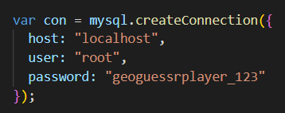

# Node-Tutorial

## 1.Para poder ejecutar los scripts debe cambiar la contraseña de mysql por la usada en el equipo personal donde se va a probar

### 2.Creación de la base de Datos

### 3. Insertar información en la base de datos

### 4.Borrar en la base datos

### 5.Elegir que registro borrar

### 6.Hacer un Join con la información de la DB

### 7.Mostrar la información de una persona usando select

### 8.Actualizar un dato de una persona seleccionada
